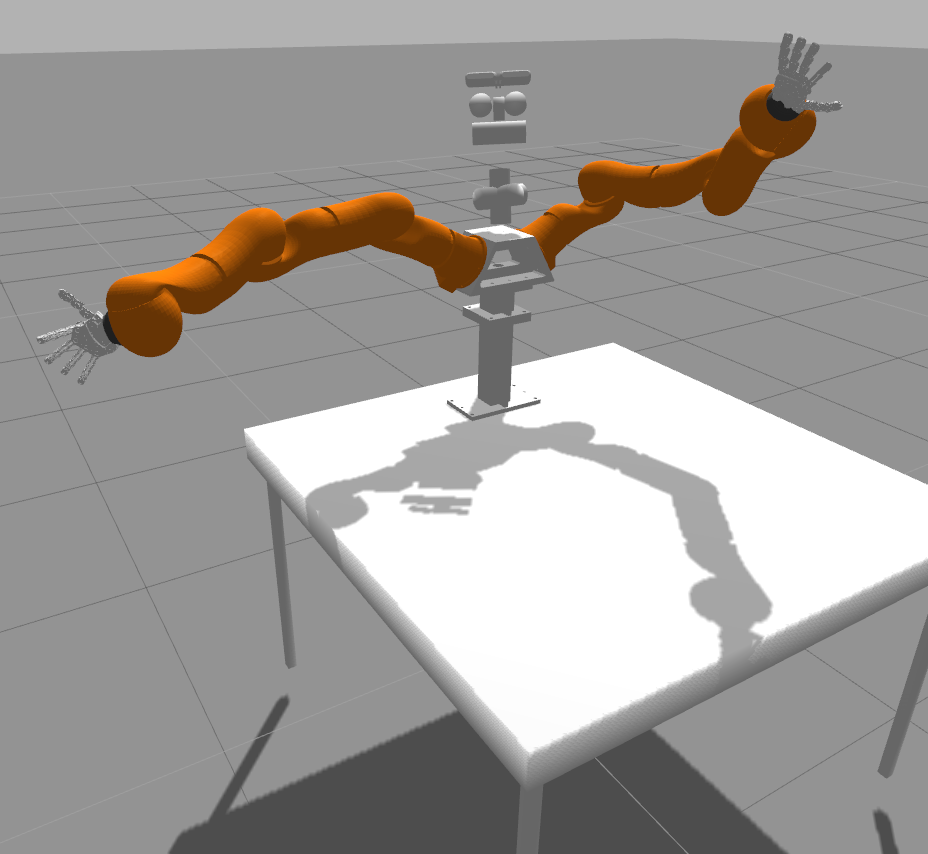
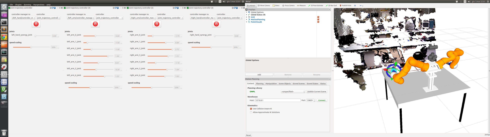

# VITO, the UNIPI Robot

The UNIPI robot is composed of two Kuka LWR equipped with two Pisa/IIT Soft Hands each. The arms are mounted on a torso that is fixed on a working table.

This package use [ROS/indigo](http://wiki.ros.org/indigo/Installation/Ubuntu), [Gazebo4](http://gazebosim.org/tutorials?tut=install_ubuntu&ver=4.0&cat=install) on [Ubuntu 14.04](http://www.ubuntu.com/download/desktop).

## Local dependencies

- You need to clone the repositories containing the components of the robot:
    * [Pisa/IIT SoftHand](https://github.com/CentroEPiaggio/pisa-iit-soft-hand.git)
    * [KUKA LWR](https://github.com/CentroEPiaggio/kuka-lwr.git)
    * [KIT Head](https://github.com/CentroEPiaggio/kit-head.git)

- For simulation, you need [Gazebo4](http://gazebosim.org/tutorials?tut=install_ubuntu&ver=4.0&cat=install) or later to install `sudo apt-get install ros-indigo-gazebo4-ros` only. Additionally, you need to clone the forked repositories regarding:
    * [gazebo_ros_packages](https://github.com/CentroEPiaggio/gazebo_ros_pkgs.git)
    * [ros_control](https://github.com/CentroEPiaggio/ros_control.git)
   
    IMPORTANT: all repos above must be checked out to the `multi-robot-test` branch.

- For the real scenario, you need to perform camera-robot calibration. We provide a [calibration](https://github.com/CentroEPiaggio/calibration.git) package that can help you to do that. However, other method that provides where the cameras (asus and two eyes of the KIT head) are w.r.t. the world is valid.

Note: you must fulfil dependencies of all dependencies as well.

## Use

The command to launch the robot in simulation is:
`roslaunch vito_description display.launch`

The command to launch the robot for real is:
`roslaunch vito_description display.launch use_rviz:=true load_moveit:=false use_calibration_package:=false left_arm_enabled:=true right_arm_enabled:=true use_robot_sim:=false`

Please, edit it at `vito_descrtiption/launch/display.launch` for the available options.

By default, the simulation is paused at the begining to wait for all controllers and stuff load, otherwise, the robots move around without control. When the command above stop sending messages on the screen, you need to call the following service in a different terminal:

`rosservice call /gazebo/unpause_physics`

By default, in the real scenarion, the [calibration](https://github.com/CentroEPiaggio/calibration.git) package is used as default, if you are using an external calibration, remember to disable it in the `display.launch` file, or just launch as:
`roslaunch vito_description display.launch  use_calibration_package:=false`

The configured groups in MoveIt! for this robot are:
* `right_arm`: a serial kinematic chain from `world` to `right_arm_7_link`
* `right_hand_arm`: a serial kinematic chain from `world` to `right_hand_palm_link` 
* `left_arm`: a serial kinematic chain from `world` to `left_arm_7_link`
* `left_hand_arm`: a serial kinematic chain from `world` to `left_hand_palm_link` 
* `head`: a kinematic tree containing all joints that belongs to the head
* `dual_hand_arm`: it contains groups `right_hand_arm` and `left_hand_arm` for bi-manual tasks.
* `full_robot`: it contains the grous `right_hand_arm`, `left_hand_arm` and `head`

There is a home pose called <GROUP_NAME>_home for each group that you can use readly.

Note: the `right_hand_arm` and `left_hand_arm` groups, hence the `full_robot` as well, do not include the hand synergy joints. This is only because in our demos, we don't _plan_ the hand closure, but just close it.

For the real scenario, check instruction on each of the components on how to set the real hardware up properly.

IMPORTANT: We don't use the mounting plate on the KUKA arms, the small disc that can be attached to the 7th link before the true end-effector. This is important for calibration and mounting the hand to be consistent with the model.

## Camera-robot calibration

If you use [this calibration](https://github.com/CentroEPiaggio/calibration.git) package, we provide the robot model that contains the calibrator piece on the robot at `robot/vito_calib.urdf.xacro` that assit the calibration procedure. Just follow the instructions in the calibration package. Recall that you can use any external package for this as well.

## Useful configured commands:

UPLOAD ALL DRIVERS ONLY WITH ROBOT-CAMERA CALIBRATION BROADCASTER:
`roslaunch vito_description display.launch left_arm_enabled:=true right_arm_enabled:=true left_hand_enabled:=true right_hand_enabled:=true load_moveit:=false use_rviz:=false use_robot_sim:=false`

UPLOAD ALL DRIVERS ONLY (NO CAMERA CALIBRATION):
`roslaunch vito_description display.launch left_arm_enabled:=true right_arm_enabled:=true left_hand_enabled:=true right_hand_enabled:=true load_moveit:=false use_rviz:=false use_robot_sim:=false`

UPLOAD MOVEIT ENVIRONMENT:
`roslaunch vito_description display.launch load_moveit:=true use_rviz:=false use_robot_sim:=false`

UPLOAD EVERYTHING IN SIMULATION:
`roslaunch vito_description display.launch`

UPLOAD SIMULATION ONLY (AS IF YOU LAUNCH THE ROBOT DRIVERS IN A REMOTE PC):
`roslaunch vito_description display.launch load_moveit:=true use_rviz:=false`

A suggested hardware cockpit setup, using the joint trajectory controller rqt plugin:

